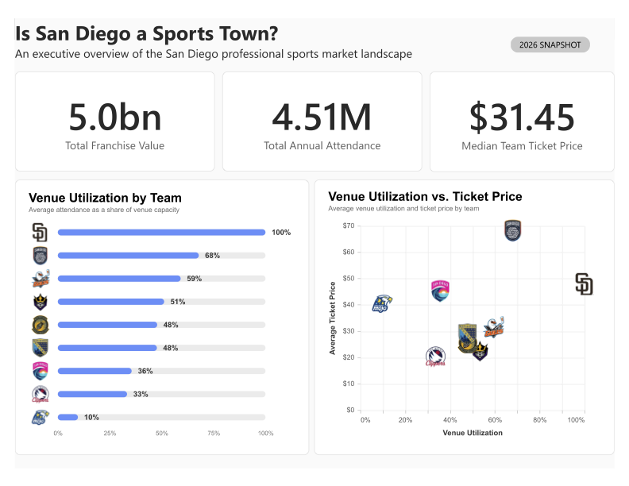

# Power BI Dashboard

## Is San Diego a Sports Town?

This dashboard provides an executive-level view of San Diego's professional sports market, combining franchise value, attendance, ticket pricing, and venue utilization into a single 2026 snapshot.

## Dashboard Files

- [View the full dashboard PDF](san_diego_sports_dashboard.pdf)
- `dashboard_preview.png` — high-resolution dashboard preview

## Key Performance Indicators

The dashboard highlights three market-level KPIs:

- **Total Franchise Value** — combined selected franchise value across the nine teams
- **Total Annual Attendance** — combined annual home attendance across the market
- **Median Team Ticket Price** — median of each team's average ticket price

## Visual Analysis

### Venue Utilization by Team

Ranks teams by average home attendance as a percentage of venue capacity.

This standardizes attendance across venues of substantially different sizes and provides a more comparable measure of how effectively each team fills its home venue.

### Venue Utilization vs. Ticket Price

Compares each team's venue utilization with its average ticket price.

The visualization helps identify differences in demand and pricing across the market, including teams combining strong utilization with higher ticket prices and teams operating with lower utilization or lower pricing.

## Interactivity

The original dashboard was developed in Power BI with cross-filtering between teams, KPIs, and visualizations.

The PDF and PNG files in this repository are static versions of the dashboard and therefore do not include the interactive functionality of the original Power BI report.

## Tools

- Power BI
- Deneb
- Vega-Lite
- DAX
- Microsoft Excel

For the underlying data and assumptions, see the [dataset](../data/) and [methodology](../methodology/methodology.md).
